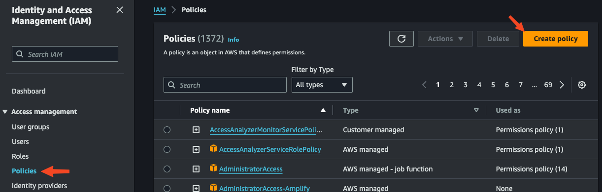

# ct-aws-backups
Repository used for creating aws backups.


 ## :warning: Attention :warning:
> :bulb: **P.O.C. Repo:**
>
> **This Repository is a Work in Progress and will be used a testing repo until the P.O.C. of the process has been completed.**


---

#### Change Log:
- 2024.02.07: Updating with process documentation for implementing via Cloudformation Gitsync

---

### Pre-requisites

- [**IAM Role**](https://docs.aws.amazon.com/AWSCloudFormation/latest/UserGuide/git-sync-prereq.html#git-sync-prereq-iam): An IAM role needs to be created with the permissions noted in linked AWS documentation.
- **Cloudformation**: Permissions to create AWS Cloudformation Stacks


### Creating IAM role
*This will be a step-by-step guide for creating the IAM role needed for creating this backup strategy.*

1. Navigate to AWS IAM 

- "**Policies**" 

- Select "**Create Policy**"



2. Select "**JSON**" 

- Copy the permissions in [AWS Documentation](https://docs.aws.amazon.com/AWSCloudFormation/latest/UserGuide/git-sync-prereq.html#git-sync-prereq-iam) into the JSON block

```json
{
    "Version": "2012-10-17",
    "Statement": [
        {
            "Sid": "SyncToCloudFormation",
            "Effect": "Allow",
            "Action": [
                "cloudformation:CreateChangeSet",
                "cloudformation:DeleteChangeSet",
                "cloudformation:DescribeChangeSet",
                "cloudformation:DescribeStackEvents",
                "cloudformation:DescribeStacks",
                "cloudformation:ExecuteChangeSet",
                "cloudformation:GetTemplate",
                "cloudformation:ListChangeSets",
                "cloudformation:ListStacks",
                "cloudformation:ValidateTemplate"
            ],
            "Resource": "*"
        },
        {
            "Sid": "PolicyForManagedRules",
            "Effect": "Allow",
            "Action": [
                "events:PutRule",
                "events:PutTargets"
            ],
            "Resource": "*",
            "Condition": {
                "StringEquals": {
                "events:ManagedBy": ["cloudformation.sync.codeconnections.amazonaws.com"]
                }
            }
        },
        {
            "Sid": "PolicyForDescribingRule",
            "Effect": "Allow",
            "Action": "events:DescribeRule",
            "Resource": "*"
        }
    ]
}
```
- Select "**Next**"


3. Enter "*Policy name*" (`cit-CloudformationGitsyncPolicy`) 

- Select "**Create policy**"


4. Navigate to "**Roles**" 

- Select "**Create role**"


5. Select "**Custom Trust Policy**" radial 

- Copy the "*Trust Policy*" in [AWS Documentation](https://docs.aws.amazon.com/AWSCloudFormation/latest/UserGuide/git-sync-prereq.html#git-sync-prereq-iam) into JSON Block

```json
{
  "Version": "2012-10-17",
  "Statement": [
    {
      "Sid": "CfnGitSyncTrustPolicy",
      "Effect": "Allow",
      "Principal": {
        "Service": "cloudformation.sync.codeconnections.amazonaws.com"
      },
      "Action": "sts:AssumeRole"
    }
  ]
}
```

- Select "**Next**"


6. Search for the policy created in previous steps (`cit-CloudformationGitsyncPolicy`)

- Select checkbox for this policy

- Select "**Next**"


7. Add "*Role name*" (`cit-CloudformationGitsyncRole`)

-  Add "*Description*" (`This role will be used by Gitsync`)

- Select "**Create role**"


### Creating Cloudformation Stack
*This process requires there to be a destination git repo*

1. Navigate to "*AWS Cloudformation*" > Select "**Stacks**" > Open "**Create stack**" drop-down > Select "**With new resources (standard)**"


2. "**Template is ready**" should already be selected > Select "**Sync from Git**" radial > Select "**Next**"


3. (a) Enter "*Stack name*" (`ct-<ENV>-AWSbackups-gitsync`)
> Suggested `<ENV>` replaces Environment Name  (ie. Sandbox, Dev, Test)

- Select "*I am providing my own file in my repository.*" radial

- Select "*Link a Git repository*" radial

- Select "*Github*" radial


3. (b) This selection requires a level of Administrator permissions on the linked Github account. For this process if the option (`cornell-cloud-devops-GH-user`) is unavailable please reach out to an Administrator of the connecting Github account. If you have administrative permissions of the target Github account, such as a personal account, select the "**add a new connection**". This connection creates a link between the repo provider and AWS.


3. (c) Using the connection selected/created in step 3b, :warning: select drop-down for the "*Repository*", find the repository and select (`ct-aws-backups`) 

> :warning: ***Attention:*** Currently (2024.02.07) this populated list can only search for the repos listed. If a repo is newly created it most likely will be at the bottom of the list and you will need to scroll through this list to find it if the list of repos is large.

- Select the drop-down for "*Branch*" and select the target branch (`deploy`) that will be polled for commits 

- In "*Deployment file path*" enter the location of the template used for this process (`cloudformation/deploy-params.yml`)
> Use the provided path if using this repo. If the template exists else where in the target repo this must match the path to the template that points to the `stackset.yml`
```yaml
# contents of deploy-params.yml
template-file-path: cloudformation/stackset.yml
parameters:
  VersionParam: 1.0.0
tags: {}
```

- Select "**Existing IAM role**" radial

- Select the previously created IAM role from above steps (`cit-CloudformationGitsyncRole`)

- Select "**Next**"


4. In "*IAM role*", select drop-down and select (`cloudformation-deploy-role`). If this option is unavailable please contact an administrator to have a Cloudformation IAM role create with proper permissions to perform Cloudformation Stack deployments.

- Leave all other options default and select "**Next**"


5. This page just reviews over the options selected. Select "**Submit**".

### Cloudformation Gitsync
*Once the stack is created it should automatically trigger a clone of the last commit to build the stack using the provided templates and stackset files.*


Once completed, Cloudformation has now created a stack that built AWS Backups. Any Changes to the `deploy` branch (or coresponding branch configured on Step 3c above) will trigger this stackset to clone the newest commit and redeploy with the stackset.yml file pointed to by the template (`deploy-params.yml`)


### AWS Backups
*This process uses AWS AMIs to create backups of instances within the environment.*

To have this process backup any instance it must have the following Tag and Value on the instance Tags:


