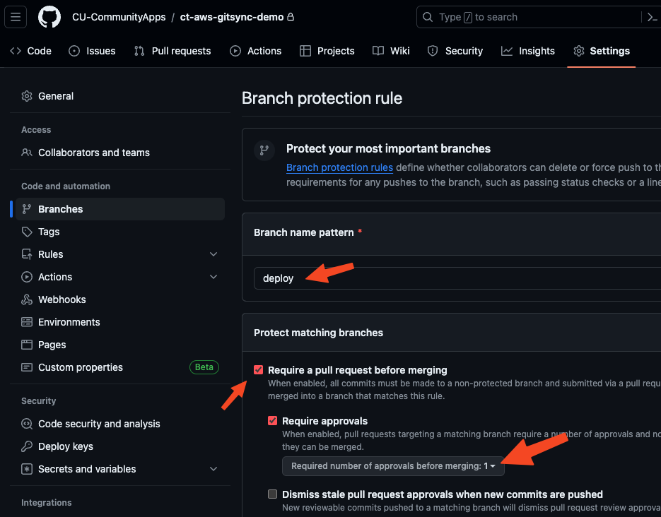

# ct-aws-backups
Repository used for creating aws backups.

---

#### Change Log:
- 2024.02.20: Update for release to customers
- 2024.02.07: Updating with process documentation for implementing via Cloudformation Gitsync

---

### Pre-requisites

- [**IAM Role**](https://docs.aws.amazon.com/AWSCloudFormation/latest/UserGuide/git-sync-prereq.html#git-sync-prereq-iam): An IAM role needs to be created with the permissions noted in linked AWS documentation.
- **Cloudformation**: Permissions to create AWS Cloudformation Stacks
- **Cloudformation IAM Role**: A role needs to be available for Cloudformation stack to use to create multiple resouces across the account. (*Creating Cloudformation Stack - Step 4*)


### Creating IAM role
*This will be a step-by-step guide for creating the IAM role needed for creating this backup strategy.*

1. Navigate to AWS IAM 

- "**Policies**" 

- Select "**Create Policy**"


2. Select "**JSON**" 

- Copy the permissions in [AWS Documentation](https://docs.aws.amazon.com/AWSCloudFormation/latest/UserGuide/git-sync-prereq.html#git-sync-prereq-iam) into the JSON block

```json
{
    "Version": "2012-10-17",
    "Statement": [
        {
            "Sid": "SyncToCloudFormation",
            "Effect": "Allow",
            "Action": [
                "cloudformation:CreateChangeSet",
                "cloudformation:DeleteChangeSet",
                "cloudformation:DescribeChangeSet",
                "cloudformation:DescribeStackEvents",
                "cloudformation:DescribeStacks",
                "cloudformation:ExecuteChangeSet",
                "cloudformation:GetTemplate",
                "cloudformation:ListChangeSets",
                "cloudformation:ListStacks",
                "cloudformation:ValidateTemplate"
            ],
            "Resource": "*"
        },
        {
            "Sid": "PolicyForManagedRules",
            "Effect": "Allow",
            "Action": [
                "events:PutRule",
                "events:PutTargets"
            ],
            "Resource": "*",
            "Condition": {
                "StringEquals": {
                "events:ManagedBy": ["cloudformation.sync.codeconnections.amazonaws.com"]
                }
            }
        },
        {
            "Sid": "PolicyForDescribingRule",
            "Effect": "Allow",
            "Action": "events:DescribeRule",
            "Resource": "*"
        }
    ]
}
```
- Select "**Next**"


3. Enter "*Policy name*" (`cit-CloudformationGitsyncPolicy`) 

- Select "**Create policy**"


4. Navigate to "**Roles**" 

- Select "**Create role**"


5. Select "**Custom Trust Policy**" radial 

- Copy the "*Trust Policy*" in [AWS Documentation](https://docs.aws.amazon.com/AWSCloudFormation/latest/UserGuide/git-sync-prereq.html#git-sync-prereq-iam) into JSON Block

```json
{
  "Version": "2012-10-17",
  "Statement": [
    {
      "Sid": "CfnGitSyncTrustPolicy",
      "Effect": "Allow",
      "Principal": {
        "Service": "cloudformation.sync.codeconnections.amazonaws.com"
      },
      "Action": "sts:AssumeRole"
    }
  ]
}
```

- Select "**Next**"


6. Search for the policy created in previous steps (`cit-CloudformationGitsyncPolicy`)

- Select checkbox for this policy

- Select "**Next**"


7. Add "*Role name*" (`cit-CloudformationGitsyncRole`)

-  Add "*Description*" (`This role will be used by Gitsync`)

- Select "**Create role**"


### Creating Cloudformation Stack
*This process requires there to be a destination git repo*

1. Navigate to "*AWS Cloudformation*" > Select "**Stacks**" > Open "**Create stack**" drop-down > Select "**With new resources (standard)**"


2. "**Template is ready**" should already be selected > Select "**Sync from Git**" radial > Select "**Next**"


3. (a) Enter "*Stack name*" (`ct-<ENV>-AWSbackups-gitsync`)
> Suggested `<ENV>` replaces Environment Name  (ie. Sandbox, Dev, Test)

- Select "*I am providing my own file in my repository.*" radial

- Select "*Link a Git repository*" radial (**Verify *Error Warning* Below**)
> #### :warning: ***Error Warning***: If a Link has already been created using this process please choose the connection using the "**Choose a linked Git repository**"!

- Select "*Github*" radial


3. (b) This selection requires a level of Administrator permissions on the linked Github account. For this process if the option (`cornell-cloud-devops-GH-user`) is unavailable please reach out to an Administrator of the connecting Github account. If you have administrative permissions of the target Github account, such as a personal account, select the "**add a new connection**". This connection creates a link between the repo provider and AWS.


3. (c) Using the connection selected/created in step 3b, :warning: select drop-down for the "*Repository*", find the repository and select (`ct-aws-backups`) 

> :warning: ***Attention:*** Currently (2024.02.07) this populated list can only search for the repos listed. If a repo is newly created it most likely will be at the bottom of the list and you will need to scroll through this list to find it if the list of repos is large.

- Select the drop-down for "*Branch*" and select the target branch (`deploy`) that will be polled for commits 

- In "*Deployment file path*" enter the location of the template used for this process (`cloudformation/deploy-params.yml`)
> Use the provided path if using this repo. If the template exists else where in the target repo this must match the path to the template that points to the `stackset.yml`
```yaml
# contents of deploy-params.yml
template-file-path: cloudformation/stackset.yml
parameters:
  VersionParam: 1.0.0
tags: {}
```

- Select "**Existing IAM role**" radial

- Select the previously created IAM role from above steps (`cit-CloudformationGitsyncRole`)

- Select "**Next**"


4. In "*IAM role*", select drop-down and select (`cloudformation-deploy-role`). If this option is unavailable please contact an administrator to have a Cloudformation IAM role create with proper permissions to perform Cloudformation Stack deployments.

- Leave all other options default and select "**Next**"


5. This page just reviews over the options selected. Select "**Submit**".

### Cloudformation Gitsync
*Once the stack is created it should automatically trigger a clone of the last commit to build the stack using the provided templates and stackset files.*


Once completed, Cloudformation has now created a stack that built AWS Backups. Any Changes to the `deploy` branch (or coresponding branch configured on Step 3c above) will trigger this stackset to clone the newest commit and redeploy with the stackset.yml file pointed to by the template (`deploy-params.yml`)


### AWS Backups
*This process uses AWS AMIs to create backups of instances within the environment.*

To have this process backup any instance it must have the following Tag and Value on the instance Tags:

- Tag Name: `cit:backup-scheme`
- Tag Value: `default`


---

### Github Repo & Git Sync

Creating protected branch for PR requirements. This process can Only be done using Github Teams or Github Enterprise.

After making a new repo go into settings and place branch protection rules on the branch required to have a Pull Request merged into the branch. The suggested idea for this is to leave the default branch main and create a new branch called deploy. Any new merge/commit to this branch will create gitsync to perform a clone of the latest commit and run the cloudformation stack.

- From Code in Github repo select dropdown for branches 
- Add branch name (`deploy`) 
- Select "**Create branch deploy from main**" (default branch)


- Github "**Settings**" for repo
- Branches
- Click "**Add branch protection rule**" 


- In "*Branch name pattern*" input "`deploy`"
- Check "**Require a pull request before merging**"
- Verify "**Require Approvals**" is set to 1 



- Scroll to the down and select "**Do not allow bypassing the above settings**"
- Select "**Save Changes**" 


This branch is now protected and can not be directly merged to unless there is a Pull Request approved before merging. This process can be overwritten and force merged but those enforced rules can be implemented when the team has agreed to what level of branch protect the team is expecting to follow.

---

### Creating a Github PR to Trigger new deploy

When Attempting to push to the "**deploy**" branch directly you should get a similar output due to the branch rule set up previously:

```bash
Performing git push on
Repo: ct-aws-gitsync-demo
BRANCH: deploy

Review changes:
diff --git a/stackset.yml b/stackset.yml
index 8d53f80..6db71ec 100644
--- a/stackset.yml
+++ b/stackset.yml
@@ -132,7 +132,7 @@ Resources:
         BackupPlanRule:
           - RuleName: DailyBackup
             TargetBackupVault: !Ref documentationvault
-            ScheduleExpression: cron(0 16 * * ? *)  # Daily at 9:00 AM EST (2:00 PM UTC)
+            ScheduleExpression: cron(30 16 * * ? *)  # Daily at 9:00 AM EST (2:00 PM UTC)
             StartWindowMinutes: 60
             CompletionWindowMinutes: 120
             Lifecycle:

Commit Message: > updating schedule directly on deploy

Adding changes...
[deploy 533859c] updating schedule directly on deploy
 1 file changed, 1 insertion(+), 1 deletion(-)

Pushing with commit message: updating schedule directly on deploy

Enumerating objects: 5, done.
Counting objects: 100% (5/5), done.
Delta compression using up to 12 threads
Compressing objects: 100% (3/3), done.
Writing objects: 100% (3/3), 305 bytes | 305.00 KiB/s, done.
Total 3 (delta 2), reused 0 (delta 0), pack-reused 0
remote: Resolving deltas: 100% (2/2), completed with 2 local objects.
remote: error: GH006: Protected branch update failed for refs/heads/deploy.
remote: error: Changes must be made through a pull request.
To github.com:CU-CommunityApps/ct-aws-gitsync-demo.git
 ! [remote rejected] deploy -> deploy (protected branch hook declined)
error: failed to push some refs to 'github.com:CU-CommunityApps/ct-aws-gitsync-demo.git'
```

- Create a new github branch from "deploy" branch:


```bash
❯ git checkout deploy
branch 'deploy' set up to track 'origin/deploy'.
Switched to a new branch 'deploy'
❯ git checkout -b deploy-rlp243-DocPRtrigger
Switched to a new branch 'deploy-rlp243-DocPRtrigger'
```


- Make any new stack changes to the yml 
- Update the branch with a push and create a new PR from link provided:


```bash
❯ git checkout deploy
branch 'deploy' set up to track 'origin/deploy'.
Switched to a new branch 'deploy'
❯ git checkout -b deploy-rlp243-DocPRtrigger
Switched to a new branch 'deploy-rlp243-DocPRtrigger'
❯ git add .
❯ git commit -m "new schedule time for documentation PR trigger"
[deploy-rlp243-DocPRtrigger acdd6c0] new schedule time for documentation PR trigger
 1 file changed, 1 insertion(+), 1 deletion(-)
❯ git push
fatal: The current branch deploy-rlp243-DocPRtrigger has no upstream branch.
To push the current branch and set the remote as upstream, use

    git push --set-upstream origin deploy-rlp243-DocPRtrigger

To have this happen automatically for branches without a tracking
upstream, see 'push.autoSetupRemote' in 'git help config'.

❯ git push --set-upstream origin deploy-rlp243-DocPRtrigger
Enumerating objects: 5, done.
Counting objects: 100% (5/5), done.
Delta compression using up to 12 threads
Compressing objects: 100% (3/3), done.
Writing objects: 100% (3/3), 311 bytes | 311.00 KiB/s, done.
Total 3 (delta 2), reused 0 (delta 0), pack-reused 0
remote: Resolving deltas: 100% (2/2), completed with 2 local objects.
remote:
remote: Create a pull request for 'deploy-rlp243-DocPRtrigger' on GitHub by visiting:
remote:      https://github.com/CU-CommunityApps/ct-aws-gitsync-demo/pull/new/deploy-rlp243-DocPRtrigger
remote:
To github.com:CU-CommunityApps/ct-aws-gitsync-demo.git
 * [new branch]      deploy-rlp243-DocPRtrigger -> deploy-rlp243-DocPRtrigger
branch 'deploy-rlp243-DocPRtrigger' set up to track 'origin/deploy-rlp243-DocPRtrigger'.
```

*Using Ctrl+Click in the terminal should jump to the Pull Request creation page in Github.*

- Change the merge destination branch to "**deploy**". 
> Normally you would expect that the merge would be to the branch you originally branched off of but this process seems to auto select the default branch for the repo. This might need to create the default branch in the repo to "deploy" to eliminate this one step and simplify the process.


- Update Title to be more descriptive of PR
- Update Description
- Assign yourself and/or persons taking responsibility
- Review Changes at the bottom
- Select "**Create pull request**"


If Rules are working as expected you should see the PR is blocked as it needs at least 1 person's approval to merge into "**deploy**" branch


Make a request to persons able to review. If you are the "Reviewer" make comments for any changes or alterations. 
- Select "**Files changed**" 
- *To Approve:* Select "**Review changes**"
- Add a comment
- Select "**Approve**" radial
- Select "**Submit review**" 


As long as there aren't any conflicts you should be able to merge. It is best practice for the person creating the PR for merging is the one to perform the merge and verify the merge does not break anything.

- Select "**Merge**"


- Select "**Confirm merge**"


> Depending on the team most teams tend to delete merged branches to keep the repo clean. For this instance I will be deleting as this is only created for documentation purposes.
> 

---

Once this PR merges into "**deploy**" branch the Cloudformation stack will notice the commit change in the "**deploy**" branch from the merge and trigger the redeploy of the changes. 


This PR changes updated the AWS Backup schedule to be 16:30 UTC (11:30 EST). 

> *Note: If Cloudformation redeploys a stack you will need to navigate to the plan again as it is a new plan it created in place.*


Once the scheduled cron runs the job it creates an EC2 Instance type (AMI Resource). Performing a restore of this instance redeploys the entirety of the instance.


